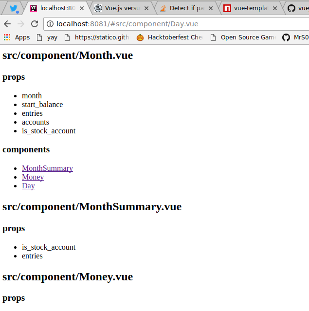

# Vue.js versus React: the (self-)documentation angle

So, lately I've been 
experimenting a tad with [React][react] and [Vue.js][vue]. I've first tried 
React, then jumped to Vue, then went back to React, spent sometime there, and
last week decided to return once more to Vue.

... Yeah, making up my mind isn't exactly my strongest suit.
But anyway. In an effort to compare apples to apples, I've decided to 
pick a small application I've written in React, and convert it into Vue to 
see a direct equivalence between the two. The application, if you are curious,
is a mix of a [Dancer][dancer] REST server leveraging the ORM magic of
[DBIx::Class][dbix] that reads the sqlite database created by
[KMyMoney][kmymoney], and the React web application feeding from it and
rendering pretty reports. Why I would create a full-stack application to
generate bank reports because I found the ones produced natively to be lacking
pizzazz is a fair question, but one that won't be addressed here. 

So, after I did that conversion, what is the main verdict? In a nutshell:
it's pretty much a choice between chocolate
and strawberry ice creams -- there are differences, but both are more than
likely to make you happy.

However, I found that the more I use them, the more Vue has an edge for
producing slightly cleaner, sane code.

## Piece of evidence #1: separation of concerns

One of the selling points of React is that "It's only JavaScript!". It's true,
and to be fair it's very appealing. There is a reason why I kept using [Mason][mason] for
my Perl projects for a long time; why learn and use a template
syntax that is purposefully gimpy when we can instead call on a well-known,
Turing-complete warhorse? 

As it turns out, with great powers come messy eating. When one can, one tends
to inject blobs of code in the template code. It's fast, it's handy, it...
doesn't make for easy reading. 

Which is where Vue's Single Component Files shine. Through the years I've seen
my share of frameworks and template systems, but I have to say that Vue is the
one that makes the separation of concerns not only feel natural, but also
*easy*. With its SCFs that keep the template and code close by, yet
segregated, I find myself first prototyping the component with static HTML,
then progressively replace the chunks that need to be dynamic. When
[Storybook][storybook] is used, that can make for wicked tight iterative
work.

<Hackthrough>

<Hackstep src="Month.html">

Here's the React version of one of the components. Not horrendous
by any standard. 

</Hackstep>

<Hackstep src="Month.html" lines="14-29">

But the template itself is kinda buried deep in the file.

</Hackstep>

<Hackstep src="Month.html" lines="18,20">

Code in the middle of the template is meh.

</Hackstep>

<Hackstep src="Month.html" lines="23-26">

And those iterations really get clunky fast.

</Hackstep>

<Hackstep src="Month_vue.html">

Contrast with the vue component. 

</Hackstep>

<Hackstep src="Month_vue.html" lines="1-17">

The template is upfront and center, giving emphasis on what the component is
about rather than how it's being operated behind the curtain.

</Hackstep>

<Hackstep src="Month_vue.html" lines="6,27-29,35">

Formatting is addressed by filters, which are more visually distinct.

</Hackstep>

<Hackstep src="Month_vue.html" lines="12-14"> 
And yeah, that's a list iteration that is softer on the eye. 

</Hackstep>

</Hackthrough>

## Piece of evidence #2: Ifs and Loops

Something else that doesn't make for easy ready is how React deals with `if`s
and iterations over lists. Is the idiomatic way to deal with those clever?
Yes, very. Do somebody at ease with JavaScript likely to have a problem understanding what is going on?
Not really. Will it requires of them to pause each time and parse *how* things
are implemented to *what* is implemented? I think so.  It's not a huge thing,
but that's what makes the difference between code that is not hard to read,
and code that is *easy* to read.

<Hackthrough>

<Hackstep src="ifs.javascript">

Let's be honest. Do you prefer this?

</Hackstep>

<Hackstep src="ifs_vue.html">

... or that?

</Hackstep>

<Hackstep src="loop.javascript">

How sharply are you tilting your head to grok this?

</Hackstep>

<Hackstep src="loop_vue.html">

Versus that?

</Hackstep>

</Hackthrough>

## Piece of evidence #3: Shadows of self-documentation

Something else that I very much appreciate about Vue is the 
way the components are declared as a simple object. Just by looking
at it, one can have a pretty good idea what are the component's
characteristics.

<Hackthrough>

<Hackstep src="object.javascript" lines="2,3">

For example, this component accepts all those props...

</Hackstep>

<Hackstep src="object.javascript" lines="4">

... uses (or might use) those components within its template...

</Hackstep>

<Hackstep src="object.javascript" lines="5">

... uses this filter...

</Hackstep>

<Hackstep src="object.javascript" lines="6">

... and has one function that munges prop to get
a derived value. 

Got it.

</Hackstep>

</Hackthrough>

In fact, those component objects are so descriptive...

<Hackthrough>

<Hackstep src="doc_app.javascript">

...one could be almost
tempted to write code that gathers that information for all the 
components an app use...

</Hackstep>

<Hackstep src="doc_app2.javascript">

... and feed them to a meta-app...

</Hackstep>

<Hackstep src="doc_app3.javascript">

... that grooms them into self-generated documentation.

</Hackstep>

</Hackthrough>

Yes, one could almost be tempted to do that. But that'd be silly.

Also look like this:

Enjoy!

[mason]: https://metacpan.org/release/HTML-Mason
[react]: https://reactjs.org/
[vue]: https://vuejs.org/
[dancer]: https://metacpan.org/release/Dancer2
[dbix]: https://metacpan.org/release/DBIx-Class
[kmymoney]: https://kmymoney.org/
[redux]: http://redux.js.orgA
[vuex]: https://github.com/vuejs/vuex
[storybook]: https://github.com/storybooks/storybook
